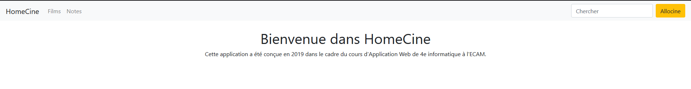
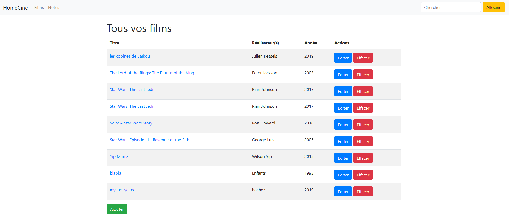
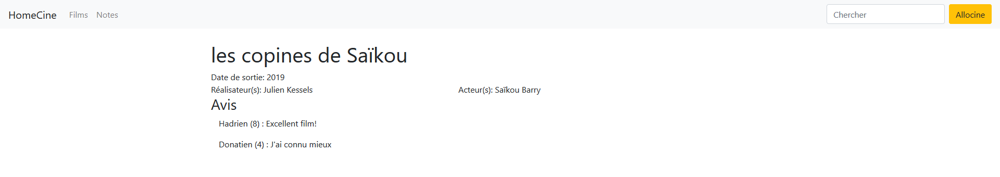
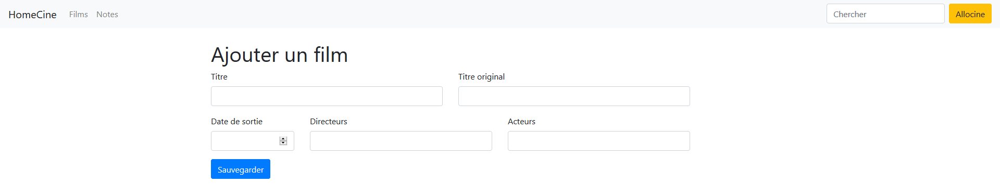
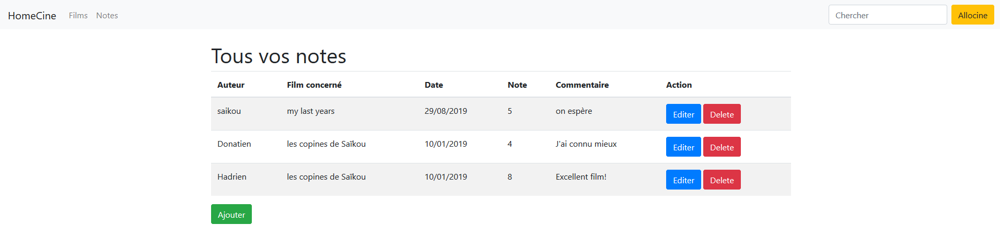

# HomeCine Application
School task written with Symfony and Angular

### project
the application allows user to find a movie with the API Allocine through the app HomeCine, to save them in a DB and to add some comment.
A movie has :
* a title
* an original title (english)
* a production year
* directors
* actors
* list of comments

At least, each movie has to have a title.

Each comment has :
* a writer
* a movie to which it is related
* a score
* a commentary

If a movie is deleted, all its comments are deleted.

Screenshot :

